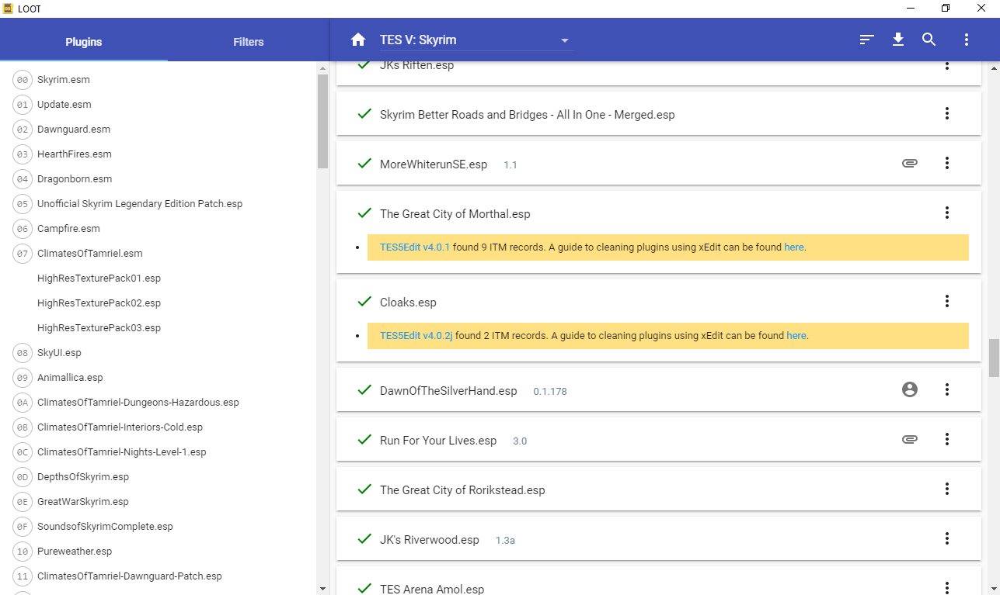

# Dawn of the Silver Hands -- Join the Silver Hands!


_For centuries the Daedric Wolves lived among the sons of Skyrim in secret._

_But no one wanted to believe._
_Or had the strength to fight._

_Now it is up to YOU to choose which side will prevail._

_The Beast Blood... Or the Silver Hands!_

Contents: 
1. Overview
1. Lore
1. How to Start
1. Playthrough
1. Requirements
1. Installation
1. Troubleshooting
1. FAQ
1. Credits

## Overview

This mod allow you to join the Silver Hand faction!

It is up to you to decide! You can still follow the vanilla path joining The Companions, but this mod allow you to see an alternate timeline where the Dragonborn joins the Silver Hand instead!


**Dragonborn as a Silver Hand!**

This mod tries to imagine how would be the sequence of facts if he decided to join the Silver Hands instead. It is not a simple mod with some bounty quests. It has a full story-line that tries to follows the same sequence of facts you see in The Companions quest-line, but from the Silver Hands perspective:

* Find the missing pieces of Wuulthad!
* Work in the shadows to dismantle The Companions plans!
* **Defend Gallows Rock** from Companions invasion, and **attack Jorrvaskr**!
* Reassemble the legendary Axe Wuuthrad!

The amount of content added by this mod is similar in therms of game-play with The Companions content, alongside with **two new Silver Hand's locations** and a new **Player House**.


**Improoved Experience**

A new **soundtrack** is added to both factions, to reflect the moods of The Companions and The Silver Hands. The Companions have a glorious, urban and bard-sh mood, to reflect their proud. The Silver Hands have a darker and wild-sh and seclude soundtrack, reflecting they are isolated in the wilds.

If you join the Silver Hands, new content will be available:

* Acquire a new house in Gallows Rock;
* Two new followers;
* Forge and Upgrade Silver Weapons, and learn to forge stronger type of Silver Sword;
* New unique weapons and armours;
* 5 new radiant quests to allow a limitless game-play content for the faction.


## Lore


This mod tries to be as lore-friendly as possible. Since not much is explicitly said about the Silver Hands the the series, some speculations exercises are made. 

I started to write the story for this mod before FudgeMuppet released their video about the Silver Hands. The funny thing is some of his conclusions about the past of the Silver Hands are mine as well.

I highly recommend you to watch his video before playing my mod:

https://www.youtube.com/watch?v=TXf46T8dVck

Some assumptions I took about the past of the Silver Hands are:

* They were formed as a dissident group of The Companions after Terrfyg (https://elderscrolls.fandom.com/wiki/Terrfyg) made the pact with the Glenmoril Witches (https://elderscrolls.fandom.com/wiki/Glenmoril_Witches). They are called "dissidents" by Kodlak and Vignar.

* The Silver Hands are very devoted to the Ysgramor legacy, and they see themselves as the true holders of his legacy in Skyrim.

* The Silver Hands are a recluse faction, but keep relationships with farmers, villagers and some Jarls.

* In the start of the game the Silver Hands have the possession of four fragments of Wuulthrad, the same number of fragments The Companions have. They were searching for the fragments since their foundation.


## How to Start

There are three entry-points in the game to start the Silver Hand quest-line:

1. Go to the tavern "The Drunken Huntsman" in Whiterun. Talk to a man called Irronkas. He should be walking around.
2. Go to Driftshade Refugee and talk to the guard. 
3. Go to Gallows Rock and talk to the guard.

Following any option, you will be redirected to Gallows Rock, and a quest will start. 
 
Some notes about the gameplay: 

* In the start of the game the Silver Hands will be **neutral** to the player;
* You will not be able to complete this quest after you complete the quest "Take Up Arms". If you do, the quest "Silver Hunt" will fail, and the Silver Hands will become **aggressive** to you -- as they are in the Vanilla;
* If you complete the quest "Silver Hunt" **The Companions** will become **aggressive** to you. Therefore you may have some trouble completing any quest that depends of Vignar, and walking inside Whiterun. The guards will be nice to you, but any Companion will try to kill you. **This is NOT A BUG**, this is an intend behaviour of the mod to increase immersion. They will not be aggressive to you forever. After you finish the quest-line The Companions (that are alive) will be nice to you once again... and this includes Vignar. After the conflict is resolved you will be able to do quests for him once again.


## Playthrough

(coming soon...)

## Requirements

No requirements, except the Vanilla game. No DLC is required as well (but they are recommended).


## Installation 

To install **manually** just place the contents of the zip inside the Folder "Data" in the Skyrim installation directory. 

It is recommended that you play it in a new game, but it is not strictly necessary, as long you didn't had killed a bunch of Silver Hands in their Camps. If you did, I recommend you to start a new game. If you didn't, you should have no issues relate with it.


## Compatibility

**Known mods with Incompatibities**

* Sounds of Skyrim Complete LE (https://www.nexusmods.com/skyrim/mods/89394)
* Cloaks of Skyrim https://www.nexusmods.com/skyrim/mods/12092
* OBIS - Organized Bandits In Skyrim (https://www.nexusmods.com/skyrim/mods/31264/)


**Fixing Compatibility issues: Short Answer (or 5 minutes solution)**

This mod will conflict with the following mods, and can conflict with any mod that changes the Companions quest-line, the Skyrim soundtrack, and Bandits/Silver Hands NPCs/LeveledLists from Vanilla game. 

If you are having some problems with another mod, placing **THIS** mod **AFTER** the mod with conflict will fix the issues in 95% of the cases, and you will be able to play both mods :). 

If you are **not sure** which mod is causing conflict, just place it as the last mod to be loaded.


**Fixing Compatibility issues: Long Answer**

When the Skyrim engine is loading the objects from your mods, the last loaded plugins have an higher priority. This means that if two mods overwrite the same content from Vanilla game, the last loaded mod will erase the changes from the first mod.

This mod changes:
* The Companions Quest-line;
* Silver Hand and **BANDITS NPCS**;
* The Soundtrack.

Therefore, if you are using a mod that changes any of this items, you probably will be able to play this mod. Some things may work, but other odd things may happen. For example, all the silver hands can start attacking you. Or, you will be able to join the Companions and the Silver Hand, which can broke the game.

Placing the mod **AFTER** any mod that changes this elements in the Vanilla game will probably fix any issue.

In theory this mod should not have any incompatibility with mods that does not change these contents... in theory...  There is common problem called "*Wild Edits*", were a giver mod include contents from Vanilla game inside the mod plugin. 
https://tes5edit.github.io/docs/7-mod-cleaning-and-error-checking.html
The problem is, if some content is overwrite by some mod, and a second one overwrite it back to the Vanilla content, this change will be deleted from the actual game.

This "*Wild Edits*" in theory is an issue that should be fixed by the mod author during the development time, but it is not always the case. 

On my tests I realised the mod Cloaks of Skyrim has conflicts with this mod, although in theory it should not have.  
https://www.nexusmods.com/skyrim/mods/12092 
Placing it after this mod solved the problem.

To solve this kind of conflict, I suggest using LOOT in combination with TESVEdit.  As you can see in the screenshot below, LOOT indicates that the mod "*Cloaks.wsp*" does have ITM records, which are wild edits. They are entries identical to the Vanilla Game.



There are plenty of tutorials in the internet about this subject. I'll just cover a basic check, and I'll not go in details. 

If load all the mods with TESVEdit, you will find the position each mod is currently loaded. If you open the group menus, you will realise that some entries are in white, green or red. 
- **White** indicates that the entry is something new, and should not conflict with anything. 
- **Green** indicates that some entry from the game is changed, but with no conflict, usually an addition.
- **Red** indicates a conflict between plugins, and just the last loaded will exist in the actual game-play. 

When verifying this mod, pay special attention for the groups **Faction**, **Non-Player Chacter (Actor)**, **Quest** and **Weapon**. if any entry is displayed in **RED**, ensure this mod is the one loaded last.


_Silver Hand Faction is changed._


_Changed NPCs are highlighted._


_Quest C00 is changed. Dawn of the Silver Hands must be loaded last._


_Silver Sword and SilverGreatSword are changed. Dawn of the Silver Hands must be loaded last._

Conflicts in the group **Worldspaces** and **Location** should not cause issues.


## Troubleshooting

First of all: I advise testing first if the mod has any clear conflict. It can be done transporting a character to any Silver Hand camp, and checking if they are aggressive against you. This can be done typing in the load screen `ESC`, and then:


```
# Teleport to Gallows Rock
coc GallowsRockExterior
```

_NOTE: I'll put comments on the code after the hash (#) explaining what the command does, but they should not be typed._

If they are fine to you, probably everithing should be working well. 

I also advise saving your game oftern. 

If you have any trouble in the questline, please contact me using the comments section. I'll be creating a discord server for this purpose as well. I'll try to answer as soon as possible.

I also created some codes to help debug the game during the development phase, and did not took they off from the final version. 
If you loaded the mod in the right order, they probably are not necessary at all. 

But in any case, ff something weird happened and, for some reason, a quest is stuck, and cannot be completed, they can be used. 

**DO NOT USE UNLESS YOU ARE 100% THE QUEST IS STUCKED!!** 
Some quests and objectives will require waiting some days, so do not try them out before checking the playthrough section!!


```
#### Main quests Codes ####


# Starts quest Silver Hunt
setstage DSilHand_A01Troubleshoot 10

# Finishes quest Silver Hunt
setstage DSilHand_A01Troubleshoot 11


# Starts quest Angarvunde's Treasure
setstage DSilHand_A01Troubleshoot 20

# Finishes quest Angarvunde's Treasure
setstage DSilHand_A01Troubleshoot 21


# Starts quest Scholar Fragment
setstage DSilHand_A01Troubleshoot 30

# Finishes quest Scholar Fragment
setstage DSilHand_A01Troubleshoot 31


# Starts quest Companion Conspiracy
setstage DSilHand_A01Troubleshoot 40

# Finishes quest Companion Conspiracy
setstage DSilHand_A01Troubleshoot 41


# Starts quest Wolf Ambush
setstage DSilHand_A01Troubleshoot 50

# Finishes quest Wolf Ambush
setstage DSilHand_A01Troubleshoot 51


# Starts quest  Retaliation
setstage DSilHand_A01Troubleshoot 60

# Finishes quest  Retaliation
setstage DSilHand_A01Troubleshoot 61


# Starts quest  Uncovering the Past
setstage DSilHand_A01Troubleshoot 70

# Finishes quest  Uncovering the Past
setstage DSilHand_A01Troubleshoot 71


# Starts quest  Assault on Jorrvaskr
setstage DSilHand_A01Troubleshoot 80

# Finishes quest  Assault on Jorrvaskr
setstage DSilHand_A01Troubleshoot 81


# Starts quest  In honor of Ysgramor
setstage DSilHand_A01Troubleshoot 90

# Finishes quest   In honor of Ysgramor
setstage DSilHand_A01Troubleshoot 91


#### Side quests Codes ####


# Starts quest  Dwammer Tempering
setstage DSilHand_A01Troubleshoot 101

# Finishes quest Dwammer Tempering
setstage DSilHand_A01Troubleshoot 111


# Starts quest Iconoclastic Revenge
setstage DSilHand_A01Troubleshoot 102

# Finishes quest Iconoclastic Revenge
setstage DSilHand_A01Troubleshoot 112


#### Radiant quests Codes ####


# Initialize Radiant quests
setstage DSilHand_A01Troubleshoot 200

# Finishes radiant quest  Wolf Hunt
setstage DSilHand_A01Troubleshoot 221

# Finishes radiant quest  Beast Extermination
setstage DSilHand_A01Troubleshoot 222

# Finishes radiant quest  Werewolf Lair
setstage DSilHand_A01Troubleshoot 223

# Finishes radiant quest Witch Hunter
setstage DSilHand_A01Troubleshoot 224

# Finishes radiant quest Fjol's Research
setstage DSilHand_A01Troubleshoot 225


#### Auxiliary Codes ####


# Acquire House at Gallows Rock
setstage DSilHand_A01Troubleshoot 303

# *WARNING*: NEVER USE THIS CODE IF YOU ARE NOT A COMPANION 
# Force the essential Silver Hands to be disabled.
# this is a hot fix for conflict with another mods, usually not necessary 
setstage DSilHand_A01Troubleshoot 401

```

## FAQ

1. Can I join both The Companions and The Silver Hands?

_No_

2. This mod will be released for the Special Edition?

_Yes! I plan to do so. But some bugs occurred after I tried to do my first port. First I was planning to release for both version at the same time. But since this version is already fine, I decided to release it first here._


## Credits

AndersonPaschoalon - Story, Level Design, and Scripting.
[Github](https://github.com/AndersonPaschoalon)
[Youtube](https://www.youtube.com/user/AndersonPaschoalon)


Heather Longail - Soundtrack.
[Soundcloud](https://soundcloud.com/serratedskies)
[Youtube](https://www.youtube.com/c/serratedskies)
[Twitch](https://www.twitch.tv/serrated_skies)


